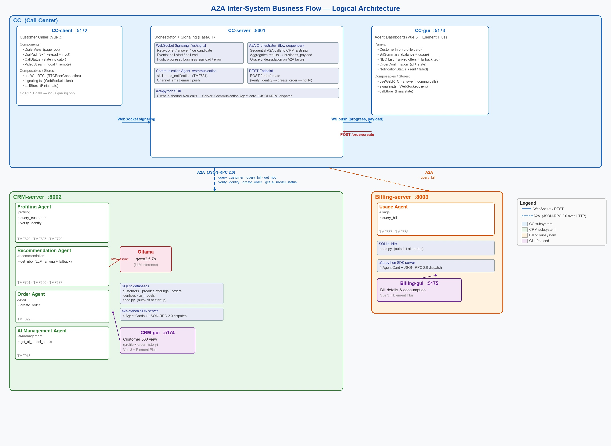
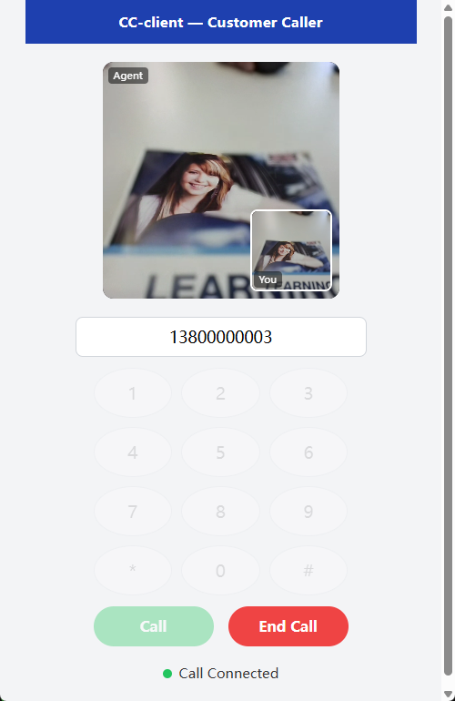
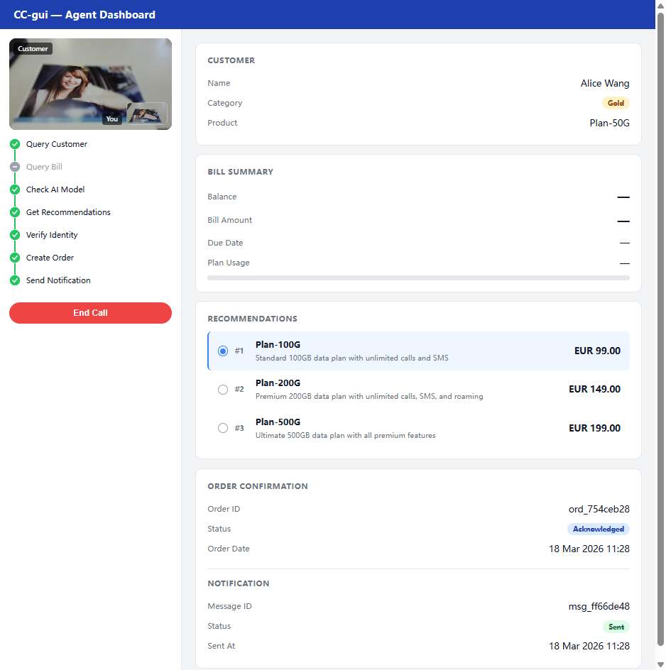

# A2A Inter-System Business Flow Demo

A telecom call center demo demonstrating end-to-end business process integration across multiple subsystems using the **A2A (Agent-to-Agent) Protocol**.

---

## Overview

A customer calls in via WebRTC. CC-server receives the call event and orchestrates CRM and Billing subsystems via A2A (JSON-RPC 2.0 over HTTP) to complete a full business loop: customer lookup, bill inquiry, AI-powered NBO recommendation, identity verification, and order placement — all surfaced on the agent dashboard in real time.

---

## Architecture

### Logical Component Diagram



<details>
<summary>ASCII version (click to expand)</summary>

```
┌─────────────────────────────────────────────────────────────────────────────────────────┐
│                                      CC (Call Center)                                   │
│                                                                                         │
│  ┌──────────────────────┐   WebSocket   ┌──────────────────────────────────────────┐    │
│  │  CC-client  :5172    │──signaling───▶│  CC-server  :8001                        │    │
│  │  (Customer Caller)   │               │                                          │    │
│  │                      │               │  ┌─────────────────────┐                 │    │
│  │  DialerView          │               │  │ WebSocket Signaling │ /ws/signal      │    │
│  │   ├─ DialPad         │               │  │ (offer/answer/ICE/  │                 │    │
│  │   ├─ CallStatus      │               │  │  call-start/end)    │                 │    │
│  │   └─ VideoStream     │               │  └─────────────────────┘                 │    │
│  │                      │               │  ┌─────────────────────┐                 │    │
│  │  useWebRTC composable│               │  │ A2A Orchestrator    │                 │    │
│  │  signaling.ts (WS)   │               │  │ (business flow      │                 │    │
│  │  callStore (Pinia)   │               │  │  sequencer)         │                 │    │
│  └──────────────────────┘               │  └─────────────────────┘                 │    │
│                                         │  ┌─────────────────────┐                 │    │
│  ┌──────────────────────┐               │  │ Communication Agent │ /communication  │    │
│  │  CC-gui  :5173       │◀──WS push─────│  │ skill:              │                 │    │
│  │  (Agent Dashboard)   │               │  │  send_notification  │                 │    │
│  │                      │  POST /order/ │  └─────────────────────┘                 │    │
│  │  CustomerInfo panel  │───create─────▶│  ┌─────────────────────┐                 │    │
│  │  BillSummary panel   │               │  │ REST: POST          │                 │    │
│  │  NBO list + fallback │               │  │  /order/create      │                 │    │
│  │  OrderConfirmation   │               │  └─────────────────────┘                 │    │
│  │  NotificationStatus  │               │                                          │    │
│  │                      │               │  a2a-python SDK client                   │    │
│  │  useWebRTC composable│               │  (all outbound A2A calls)                │    │
│  │  signaling.ts (WS)   │               └───────────┬──────────┬──────────────────┘    │
│  │  callStore (Pinia)   │                           │          │                        │
│  └──────────────────────┘                           │          │                        │
└─────────────────────────────────────────────────────┼──────────┼────────────────────────┘
                                                      │          │
                          A2A (JSON-RPC 2.0 / HTTP)   │          │  A2A (JSON-RPC 2.0)
                    ┌─────────────────────────────────┘          └──────────────┐
                    ▼                                                           ▼
┌───────────────────────────────────────────────────┐  ┌────────────────────────────────┐
│              CRM-server  :8002                     │  │    Billing-server  :8003       │
│                                                    │  │                                │
│  ┌──────────────────────────────┐                  │  │  ┌──────────────────────────┐  │
│  │ Profiling Agent  /profiling  │                  │  │  │ Usage Agent  /usage      │  │
│  │ skills:                      │                  │  │  │ skill:                   │  │
│  │  query_customer  (TMF629)    │                  │  │  │  query_bill  (TMF677/678)│  │
│  │  verify_identity (TMF720)    │                  │  │  └──────────────────────────┘  │
│  └──────────────────────────────┘                  │  │                                │
│  ┌──────────────────────────────┐                  │  │  SQLite: bills                 │
│  │ Recommendation Agent         │                  │  │  seed.py (auto-init)           │
│  │  /recommendation             │                  │  │                                │
│  │ skill:                       │  ┌────────────┐  │  │  a2a-python SDK server         │
│  │  get_nbo (TMF701/620/637)  ──┼─▶│  Ollama    │  │  │  (agent card + JSON-RPC)      │
│  │  (LLM ranking + fallback)    │  │ or else    │  │  └────────────────────────────────┘
│  └──────────────────────────────┘  └────────────┘  │
│  ┌──────────────────────────────┐                  │         ┌────────────────────────┐
│  │ Order Agent  /order          │                  │         │  Billing-gui  :5175    │
│  │ skill:                       │                  │         │  Bill details &        │
│  │  create_order (TMF622)       │                  │         │  consumption breakdown │
│  └──────────────────────────────┘                  │         │  (Vue 3 + Element Plus)│
│  ┌──────────────────────────────┐                  │         └────────────────────────┘
│  │ AI Management Agent          │                  │
│  │  /ai-management              │                  │
│  │ skill:                       │                  │
│  │  get_ai_model_status (TMF915)│                  │
│  └──────────────────────────────┘                  │
│                                                    │
│  SQLite: customers, product_offerings,             │
│          orders, identities, ai_models             │
│  seed.py (auto-init)                               │
│                                                    │
│  a2a-python SDK server                             │
│  (agent cards + JSON-RPC dispatch)                 │
└────────────────────────────────────────────────────┘
         │
         ▼
┌────────────────────────┐
│  CRM-gui  :5174        │
│  Customer 360 view     │
│  (profile + orders)    │
│  (Vue 3 + Element Plus)│
└────────────────────────┘
```

</details>

### A2A Business Flow

```
[CC-client] — WebRTC offer/answer + call-start event
      │
      ▼
[CC-server] — Orchestrator + WebRTC signaling relay
      │
      ├── A2A: query_customer ──────────────────► [CRM-server / Profiling Agent]
      │
      ├── A2A: query_bill ──────────────────────► [Billing-server / Usage Agent]
      │
      ├── A2A: get_ai_model_status (optional) ──► [CRM-server / AI Management Agent]
      │
      ├── A2A: get_nbo ────────────────────────► [CRM-server / Recommendation Agent]
      │                                                      └── Ollama (qwen2.5:7b)
      ├── A2A: verify_identity ────────────────► [CRM-server / Profiling Agent]
      │
      ├── A2A: create_order ───────────────────► [CRM-server / Order Agent]
      │
      └── A2A: send_notification ──────────────► [CC-server / Communication Agent]
                                                        │
                                                        ▼
                                                  [CC-gui] — Agent dashboard
```

---

## Project Structure

```
app/
├── Billing/
│   ├── Billing-server/     # FastAPI — Usage Agent (query_bill) [port 8003]
│   └── Billing-gui/        # Vue 3 — bill details view [port 5175]
├── CC/
│   ├── CC-server/          # FastAPI — orchestrator + WebRTC signaling + Communication Agent [port 8001]
│   ├── CC-client/          # Vue 3 — customer WebRTC caller [port 5172]
│   └── CC-gui/             # Vue 3 — agent dashboard + WebRTC receiver [port 5173]
└── CRM/
    ├── CRM-server/         # FastAPI — Profiling, Recommendation, Order, AI Management agents [port 8002]
    └── CRM-gui/            # Vue 3 — customer 360 view [port 5174]

openspec/                   # Spec-driven development artifacts
├── project.md              # Full project overview and architecture
├── AGENTS.md               # AI coding assistant instructions and conventions
├── specs/                  # Authoritative specs per subsystem
└── changes/                # Change proposals and delta specs
```

---

## Prerequisites

| Tool | Version | Install |
|---|---|---|
| Python | 3.11+ | [python.org](https://python.org) |
| uv | latest | `pip install uv` |
| Node.js | 18+ | [nodejs.org](https://nodejs.org) |
| npm | bundled with Node | — |
| Ollama | latest | [ollama.com](https://ollama.com) |

Pull the NBO model used by the Recommendation Agent:

```bash
ollama pull qwen2.5:7b
```

---

## Services & Ports

| Service | Port | Role |
|---|---|---|
| CC-server | 8001 | Orchestrator, WebRTC signaling relay, Communication Agent |
| CC-client | 5172 | Customer-side WebRTC caller (Vue 3 GUI) |
| CC-gui | 5173 | Agent dashboard, WebRTC receiver (Vue 3 GUI) |
| CRM-server | 8002 | Profiling, Recommendation, Order, AI Management agents |
| CRM-gui | 5174 | Customer 360 view (Vue 3 GUI) |
| Billing-server | 8003 | Usage Agent |
| Billing-gui | 5175 | Bill details view (Vue 3 GUI) |

**WebRTC signaling:** `ws://localhost:8001/ws/signal` (served by CC-server)

---

## Getting Started

### 1. Start Ollama

```bash
ollama serve
```

### 2. Start backend servers

Each backend uses `uv`. Run from the respective server directory:

```bash
# CC-server
cd app/CC/CC-server
uv run uvicorn src.main:app --port 8001 --reload

# CRM-server
cd app/CRM/CRM-server
uv run uvicorn src.main:app --port 8002 --reload

# Billing-server
cd app/Billing/Billing-server
uv run uvicorn src.main:app --port 8003 --reload
```

> Seed data is loaded automatically at startup via `seed.py`.

### 3. Start frontend GUIs

Run from each GUI directory:

```bash
npm install
npm run dev
```

| GUI | URL |
|---|---|
| CC-client | http://localhost:5172 |
| CC-gui | http://localhost:5173 |
| CRM-gui | http://localhost:5174 |
| Billing-gui | http://localhost:5175 |

---

## Demo: WebRTC Call Flow

1. Open **CC-gui** at `http://localhost:5173` — agent dashboard, waiting for a call
2. Open **CC-client** at `http://localhost:5172` — customer caller
3. Enter a phone number (e.g. `13800000001`) and click **Call**
4. CC-client sends a WebRTC offer → CC-server relays it → CC-gui answers → P2P audio/video established
5. CC-client sends `call-start { phone }` → CC-server runs the A2A business flow:
   - Looks up customer profile (CRM)
   - Queries bill summary (Billing)
   - Checks NBO AI model health (CRM)
   - Fetches NBO recommendations via Ollama (CRM)
6. CC-gui displays: customer info, bill summary, and ranked NBO recommendations
7. Agent selects an offer → CC-gui sends `POST /order/create` → CC-server verifies identity, places order, and sends notification
8. CC-gui displays order confirmation and notification status

---

## A2A Skills Reference

| Agent | Endpoint | Skill | TMF API |
|---|---|---|---|
| Profiling Agent | `POST /profiling/a2a` | `query_customer` | TMF629 / TMF637 |
| Profiling Agent | `POST /profiling/a2a` | `verify_identity` | TMF720 |
| Recommendation Agent | `POST /recommendation/a2a` | `get_nbo` | TMF701 / TMF620 |
| Order Agent | `POST /order/a2a` | `create_order` | TMF622 |
| AI Management Agent | `POST /ai-management/a2a` | `get_ai_model_status` | TMF915 |
| Usage Agent | `POST /usage/a2a` | `query_bill` | TMF677 / TMF678 |
| Communication Agent | `POST /communication/a2a` | `send_notification` | TMF681 |

Agent Cards are discoverable at `GET /<agent-prefix>/.well-known/agent.json`.

All A2A calls use JSON-RPC 2.0:
```json
{
  "jsonrpc": "2.0",
  "method": "tasks/send",
  "params": { "skill": "<skill_name>", "input": { ... } },
  "id": "<uuid>"
}
```

---

## TMForum Alignment

Skill interfaces align with TM Forum Open API data models (TMF620, TMF622, TMF629, TMF637, TMF677, TMF681, TMF701, TMF720, TMF915). Field names and status enumerations follow TMF conventions where practical. See [`openspec/project.md`](openspec/project.md) for the full TMForum field mapping table.

---

## Tech Stack

| Layer | Technology |
|---|---|
| Backend language | Python 3.11+ |
| Backend framework | FastAPI |
| A2A protocol | `a2a-python` SDK library (JSON-RPC 2.0 over HTTP) — agent card serving, skill registration, JSON-RPC dispatch, and A2A client calls |
| LLM backend | Ollama (`qwen2.5:7b`) |
| Data store | SQLite (per subsystem, demo only) |
| Async HTTP client | httpx (AsyncClient) |
| Backend dependency mgr | uv + pyproject.toml |
| Frontend framework | Vue 3 (Composition API, `<script setup>`) |
| Build tool | Vite |
| UI library | Element Plus |
| State management | Pinia |
| HTTP client (frontend) | Axios |
| WebRTC | Browser-native `RTCPeerConnection` (no STUN/TURN) |
| Frontend language | TypeScript |
| Frontend pkg manager | npm |

---

## Development

This project uses **OpenSpec spec-driven development**. All changes should go through the `openspec/` workflow:

- Read [`openspec/AGENTS.md`](openspec/AGENTS.md) before making any changes — it contains critical architecture rules, directory conventions, and the A2A skills registry.
- Read [`openspec/project.md`](openspec/project.md) for the full system overview and TMForum alignment tables.
- Use `/opsx:propose`, `/opsx:apply`, and `/opsx:archive` to manage changes (see `AGENTS.md` for details).

### Spec Annotation Tags

Markdown files in `openspec/` support inline annotation tags processed by Claude Code (see [`CLAUDE.md`](CLAUDE.md)):

| Tag | Action |
|-----|--------|
| `@claude: <instruction>` | Execute the instruction at that location |
| `@revise: <requirement>` | Rewrite the adjacent paragraph to meet the requirement |
| `@expand: <direction>` | Expand and elaborate on the adjacent content |
| `@delete` | Remove the annotated content block entirely |
| `@todo` | Mark as incomplete — prompts for input before proceeding |
| `@discuss: <question>` | Pause for analysis and options before editing |
| `@keep` | Do not modify this content under any circumstance |
| `@note: <remark>` | Informational only — preserved, no modification triggered |

### Demo seed data

Each server seeds its SQLite database at startup with 3 test customers:

| Phone | Customer | Plan |
|---|---|---|
| `13800000001` | Customer A | Plan-50G |
| `13800000002` | Customer B | Plan-100G |
| `13800000003` | Customer C | Plan-200G |

### Screenshots Demo for CC-client / CC-gui

| CC-client (Mobile — Customer Caller) | CC-gui (Desktop — Agent Dashboard) |
|:---:|:---:|
|  |  |

